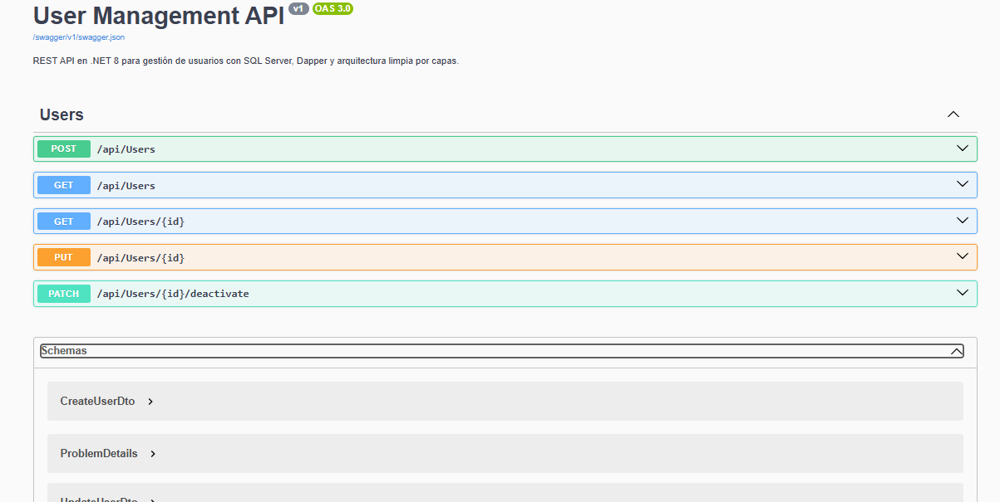
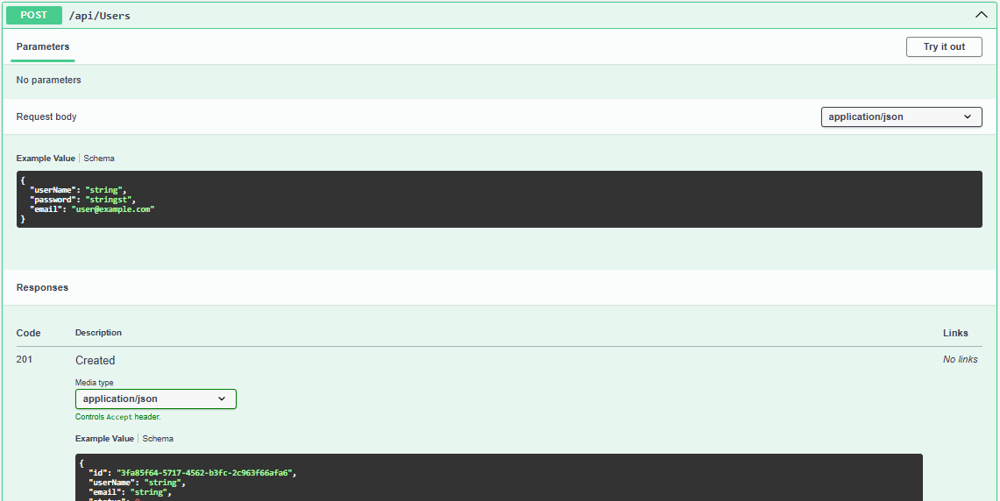
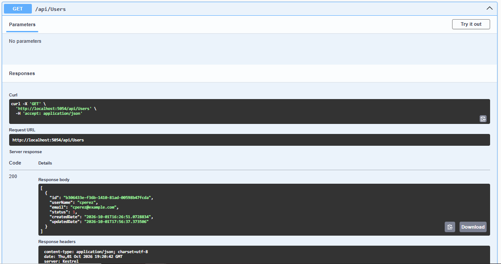
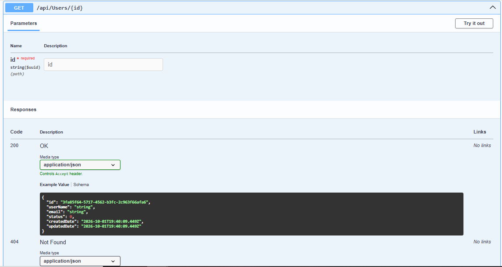
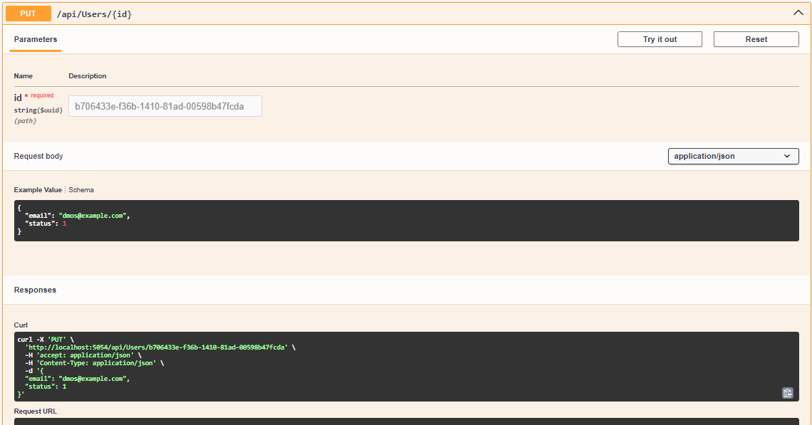
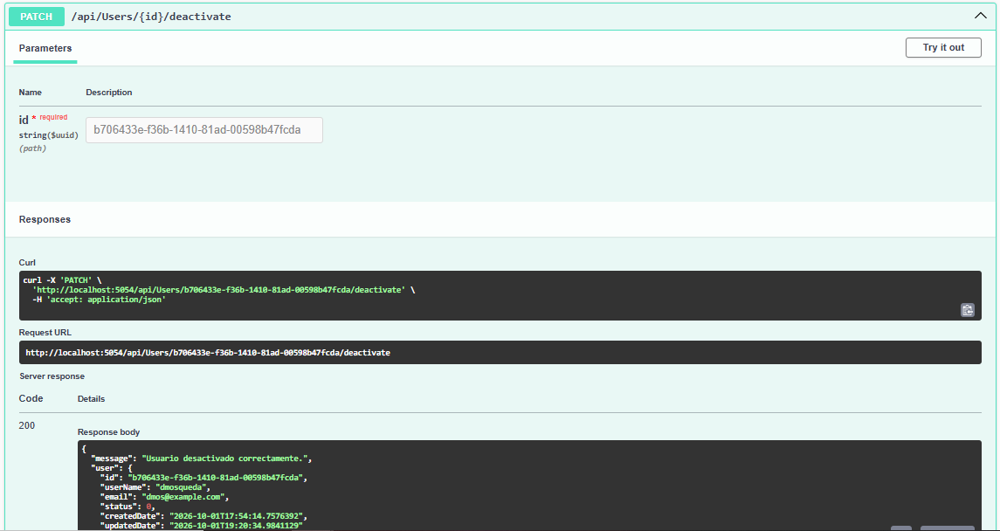

# User Management REST API (.NET 8)

**API REST** en **.NET 8** implementada para operaciones de **administración de usuarios**

---

## Documentación Interactiva Endpoints (Swagger UI)

| Swagger UI | Create User | GET Activos |
| :---: | :---: | :---: |
|  |  |  |
| **GET User by id** | **Update User** | **Deactivate User** |
|  |  |  |

---

## Stack 

| Componente | Tecnología / Herramienta |
|---|---|
| **Framework** | .NET 8 |
| **Base de Datos** | SQL Server 2022 (motor relacional contenido en docker) |
| **Seguridad** | BCrypt.Net-Next (Hasheo de contraseñas) |
| **Documentación** | Swagger / OpenAPI UI |
| **Testing** | Postman v2.1 Collection |

---

## Requisitos

- .NET SDK 8
- SQL Server (local) o Docker
- (Opcional) Postman
  
---

## Guía de instalación

**Paso 1: Clonar el repositorio**

Abre una terminal y clona el proyecto en tu máquina local:

```bash
git clone [https://github.com/RuloMtz93/UserManagementApiNet8.git](https://github.com/RuloMtz93/UserManagementApiNet8.git)
cd UserManagementApiNet8
```

Para Github Desktop:

    - Entrar a Github Desktop
    - File --> Clone repository
    - Pegar URL: https://github.com/RuloMtz93/UserManagementApiNet8.git
    - Clone

**Paso 2: Levantar el contenedor de SQL Server 2022**

Ejecuta Docker Compose desde la raíz del proyecto para iniciar la base de datos:

```bash
docker compose up -d
```
---
**Paso 3: Ejecución de script para la BD**

Ejecuta el script de la base de datos:

```bash
docker cp database/create_database_and_table.sql sqlserver-users:/tmp/create_database_and_table.sql
docker exec sqlserver-users /opt/mssql-tools18/bin/sqlcmd -S localhost -U sa -P "Password123!" -C -b -I -f 65001 -i /tmp/create_database_and_table.sql
```
--- 
**Paso 4: Ejecución de WEB API**

Ingresa al directorio de la aplicación, restaura dependencias y corre el proyecto:

```bash
cd UserManagementApi
dotnet restore
dotnet run
```
Una vez que la aplicación arranque, la consola mostrará la URL local asignada (por ejemplo, http://localhost:5000 o similar).
Abre tu navegador en esa dirección para acceder directamente a Swagger UI

--- 
## Pruebas de integración con POSTMAN

En la carpeta /Postman se incluye la suite completa de pruebas: UserManagementApi.postman_collection.json

**Instrucciones de uso**

1. Abre Postman y haz clic en el botón Import
2. Selecciona el archivo
3. Configurar la base url de la colección al puerto de tu entorno local
    - Ejemplo: `https://localhost:5054`
4. El userId se guarda automáticamente al ejecutar el flujo de prueba
     - Create User (POST): Crea un nuevo registro
     - Get Active Users (GET): Consulta el listado de usuarios con estado activo
     - Get User By Id (GET): Consulta los detalles del usuario recién creado utilizando {{userId}}
     - Put Users Id (PUT): Modifica el email y status del usuario
     - Deactivate User (PATCH): Ejecuta la desactivación lógica en /api/users/{{userId}}/deactivate
  
---
